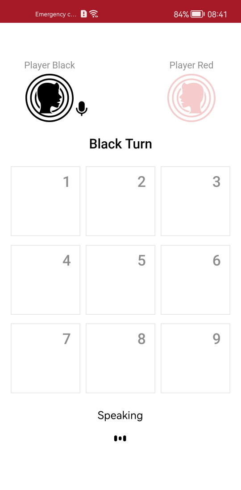

# Audible Tic Tac Toe

    

Standard Tic Tac Toe is a paper-and-pencil game for two players who take turns marking the spaces in a three-by-three grid with X or O. The player who succeeds in placing three of their marks in a horizontal, vertical, or diagonal row is the winner. 

**Audible Tic Tac Toe** is a mobile game that lets players play the game uninterruptedly without having to touch or hold the device ever.


## Introduction

Features of Audible Tic Tac Toe:
1.	It is a two player games, challenge your friends and save paper and ink.
2.  Players can control their actions through vocal prompts.
3.  The game keeps the listening feature active until you give a valid command.
4.	Players can listen to the game guide with audio.
5.	Users can review the moves they made on the end-game screen.


## About HUAWEI ML Kit - Automatic Speech Recognition

Automatic speech recognition (ASR) can recognize speech not longer than 60s and convert the input speech into text in real time. This service uses industry-leading deep learning technologies to achieve a recognition accuracy of over 95%.

For more information -> [HUAWEI ML Kit - Automatic Speech Recognition Guide](https://developer.huawei.com/consumer/en/doc/development/hiai-Guides/ml-asr-0000001050066212)

## About HUAWEI ML Kit - Text to Speech

Text to speech (TTS) can convert text information into audio output in real time. Rich timbres are provided and the volume and speed can be adjusted, thereby natural voices can be produced.

For more information -> [HUAWEI ML Kit - Text to Speech Guide](https://developer.huawei.com/consumer/en/doc/development/hiai-Guides/ml-tts-0000001050068169)


## What You Will Need

**Hardware Requirements**
- A computer that can run Android Studio.
- Huawei mobile device with a USB data cable for running developed apps

**Software Requirements**
- Java JDK 1.8 or later
- Android Studio 2021.2.x
- Android SDK package
- Android API Level 23 or higher
- HMS Core (APK) 5.0.0.300 or later
- EMUI 5.0 or later

## Getting Started

Audible Tic Tac Toe uses HUAWEI services. To use them, you have to [create an app](https://developer.huawei.com/consumer/en/doc/distribution/app/agc-create_app) first. Before getting started, please [sign-up](https://id1.cloud.huawei.com/CAS/portal/userRegister/regbyemail.html?service=https%3A%2F%2Foauth-login1.cloud.huawei.com%2Foauth2%2Fv2%2Flogin%3Faccess_type%3Doffline%26client_id%3D6099200%26display%3Dpage%26flowID%3D6d751ab7-28c0-403c-a7a8-6fc07681a45d%26h%3D1603370512.3540%26lang%3Den-us%26redirect_uri%3Dhttps%253A%252F%252Fdeveloper.huawei.com%252Fconsumer%252Fen%252Flogin%252Fhtml%252FhandleLogin.html%26response_type%3Dcode%26scope%3Dopenid%2Bhttps%253A%252F%252Fwww.huawei.com%252Fauth%252Faccount%252Fcountry%2Bhttps%253A%252F%252Fwww.huawei.com%252Fauth%252Faccount%252Fbase.profile%26v%3D9f7b3af3ae56ae58c5cb23a5c1ff5af7d91720cea9a897be58cff23593e8c1ed&loginUrl=https%3A%2F%2Fid1.cloud.huawei.com%3A443%2FCAS%2Fportal%2FloginAuth.html&clientID=6099200&lang=en-us&display=page&loginChannel=89000060&reqClientType=89) for a HUAWEI developer account.

After creating the application, you need to [generate a signing certificate fingerprint](https://developer.huawei.com/consumer/en/codelab/HMSPreparation/index.html#3). Then you have to set this fingerprint to the application you created in AppGallery Connect.
- Go to "My Projects" in AppGallery Connect.
- Find your project from the project list and click the app on the project card.
- On the Project Setting page, set SHA-256 certificate fingerprint to the SHA-256 fingerprint you've generated.

- Change the agconnect-services.json file with yours.
- To use ML Kit in your app, you also need to enable the service in [AppGallery Connect](https://developer.huawei.com/consumer/en/service/josp/agc/index.html).
- Then, obtain the API key from [AppGallery Connect](https://developer.huawei.com/consumer/en/service/josp/agc/index.html). For details, please refer to [Preparations for ML Kit Service](https://developer.huawei.com/consumer/en/doc/development/hiai-Guides/add-appgallery-0000001050038080)
- Replace the [key](https://github.com/Explore-In-HMS/Audible-TicTacToe/blob/master/app/build.gradle#L51) with the one in your API key.

## Using the Application

Upon completing the essential parts of the code, connect your mobile device to the PC and enable the USB debugging mode. In the Android Studio window, click the icon to run the project you have created in Android Studio to generate an APK. Then install the APK on the mobile device.

1.  Before you run the app, make sure that you have a working internet connection.
2.	Then, open the app upon installing it on your device.
3.	The application will ask you for permission to record audio. Please allow it to use the app with voice commands.
3.  You see a Welcome Screen that contains the "Start Game" button and, the "How to Play" button.
4.	To navigate to the "How to Play Screen", just say "How to Play".
5.	After navigating to the "How to Player Screen", you can read or listen to the guide. You can also go back to the previous screen by saying "Back".
6.  When you say "Start Game" on the Welcome Screen, you will be taken to Game Screen. Now, you can start playing.
7.  The first player is "Player Black". You can make your move by saying one of the numbers on the playing field. For example "Eight"
8.  After saying the move, it will be marked on the grid. Then, "Player Red" can make his/her move by saying one of the free numbers on the playing field.
9.	The player who places a required amount of symbols in a row with respective marks in a horizontal, vertical, or diagonal row, wins the game.
10.	After the game is over, the game will take you to the Results Screen. 
11.	On the Result Screen, you can review your moves and say "Play again" to start a new game.
12.	If you want to quit the game, you can say "Quit".


## Screenshots

<table>
<tr>
<td>
 
</td>
<td>
 
</td>
<td>

</td>
</tr>

<tr>
<td>

</td>
<td>

</td>
<td>
 
</td>
</tr>

<tr>
<td>

</td>
<td>
 
</td>
<td>
 
</td>
</tr>

</table>

## Project Structure

Audible Tic Tac Toe is designed with MVVM design pattern.

## Libraries
- Huawei ML Kit - Automatic Speech Recognition
- Huawei ML Kit - Text to Speech
- LiveData
- ViewModel
- Navigation
- ViewBinding
- Dagger Hilt
- SplashScreen API
- Lottie

## Installation
[Download Audible TicTacToe Apk](https://github.com/Explore-In-HMS/Audible-TicTacToe/raw/master/apk/AudibleTicTacToe.apk)

## Contributors
* [Abdurrahim Cillioglu](https://github.com/acillioglu)
* [Ataberk Celiktas](https://github.com/AtaberkCeliktas)
* [Ertug Sagman](https://github.com/ertug-sagman0)

# License
```xml

 Copyright 2022. Huawei Technologies Co., Ltd. All rights reserved.

 Licensed under the Apache License, Version 2.0 (the "License");
 you may not use this file except in compliance with the License.
 You may obtain a copy of the License at

 http://www.apache.org/licenses/LICENSE-2.0

 Unless required by applicable law or agreed to in writing, software
 distributed under the License is distributed on an "AS IS" BASIS,
 WITHOUT WARRANTIES OR CONDITIONS OF ANY KIND, either express or implied.
 See the License for the specific language governing permissions and
 limitations under the License.

```